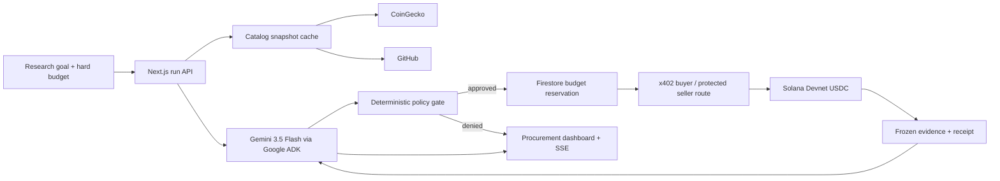

# REIN

> **Autonomy, held to proof.**

REIN is a bounded autonomous data-procurement agent for the Google Cloud x
Solana AI Agentic Hackathon. A user supplies a research goal and a hard budget;
Gemini selects only useful items from a fixed catalog, deterministic policy owns
the signing boundary, x402 settles test USDC on Solana Devnet, and the app keeps
the evidence and receipt together.

**Live:** <https://rein-vvwpcipqca-du.a.run.app>


## Verification status

| Surface | Status on 2026-07-21 | Evidence |
| --- | --- | --- |
| Deterministic local demo | Verified | Unit and Playwright tests; simulated receipts are visibly labelled |
| Desktop/mobile UI | Verified | Local desktop/mobile and a completed live Cloud Run render |
| Vertex `gemini-3.5-flash` | Verified on Vertex AI | Structured selection and evidence synthesis completed in `global` |
| x402 Solana Devnet settlement | Verified | Two finalized test-USDC transactions linked below |
| Cloud Run/Firestore deployment | Verified | `rein-00005-wh5`, live mode, Firestore, service/revision max 2 |
| PDF + 3-minute demo | Verified locally | 8 rendered PDF pages; 1:40.47 captioned H.264/AAC master |

No mainnet asset, real money, account login, arbitrary seller URL, subscription,
or multi-agent workflow is supported.

## Why it fits the track

The official track asks an agent to decide and pay without human approval at
every step, while remaining inside a defined limit. REIN demonstrates that
contract with two purchasable evidence products:

| Product | Price | Frozen pre-payment source |
| --- | ---: | --- |
| `market_snapshot` | 1,000 atomic = 0.001 test USDC | CoinGecko public API |
| `github_health` | 2,000 atomic = 0.002 test USDC | GitHub public API |

The default request purchases both products for exactly 3,000 atomic units.

## Architecture



The model never receives the signing key and cannot choose an arbitrary URL,
network, mint, payee, or price. All amounts remain decimal strings and `BigInt`
until the x402 SDK boundary.

## Local deterministic demo

Requirements: Node.js 24+, Corepack, and pnpm 11.

```powershell
corepack enable
pnpm install --frozen-lockfile
Copy-Item .env.example .env.local
pnpm dev
```

Open `http://localhost:3000`. The checked-in example uses fixture upstream data,
memory storage, and **cannot sign or broadcast**. To show current public API data
while keeping simulated settlement, set `PROOFBUY_UPSTREAM_MODE=live`.

## Public API

| Method | Path | Contract |
| --- | --- | --- |
| `POST` | `/api/runs` | `{goal,maxBudgetAtomic,preset?}` -> `202 {runId}` |
| `GET` | `/api/runs/:id/events` | Sanitized, replayable SSE milestones |
| `GET` | `/api/runs/:id` | Run, evidence, payments, receipts |
| `GET` | `/api/catalog` | Price, availability, snapshot freshness |
| `GET` | `/api/products/market-snapshot` | x402-protected frozen snapshot |
| `GET` | `/api/products/github-health` | x402-protected frozen snapshot |
| `GET` | `/api/health` | Non-secret mode/storage/model health |

## Safety invariants

- Network: `solana:EtWTRABZaYq6iMfeYKouRu166VU2xqa1` only.
- Mint: Circle Devnet USDC
  `4zMMC9srt5Ri5X14GAgXhaHii3GnPAEERYPJgZJDncDU` only.
- Purchase/run/daily caps: `4000` / `10000` / `250000` atomic USDC.
- A payment ID is bound to one quota day, snapshot hash, and request fingerprint.
  Reuse with different data is denied.
- Known settlement failure releases the reservation. Ambiguous settlement keeps
  it in `reconciling` and never auto-retries.
- Upstream data is normalized and cached before payment; paid routes return that
  exact snapshot instead of making a post-payment upstream call.
- Firestore browser access is denied; only the Cloud Run service account uses Admin SDK.

See [`docs/specs/rein-mvp.md`](docs/specs/rein-mvp.md) for the complete
contract and failure semantics.

## Live proof

The verified run `run_6f0e409bf94844558c6c7ba9f4ab9a1b` spent exactly 3,000
atomic test USDC, left zero reserved, and generated its report with Gemini 3.5
Flash. Solana RPC reported both signatures `finalized` with no chain error:

- `market_snapshot`, 1,000 atomic: [2NuicT57…9YMpArw](https://explorer.solana.com/tx/2NuicT57mQD1Uu5yumPnubCkrdSVHQUegbxLEBsDtpdVTTjw5dTdyB3QpH9t7VZLGnyQyNV9DySA9xWMY9YMpArw?cluster=devnet)
- `github_health`, 2,000 atomic: [3vpyu3Ds…i6gbcGR](https://explorer.solana.com/tx/3vpyu3DsDvDT2m71kj3Pt5GQ4Ba2jQVYkuFhWL9eTUgiVXwpMiQKpbtjSPKaV5J5K3cpff6726kXT8p5Ui6gbcGR?cluster=devnet)

These are valueless Devnet assets. The x402 facilitator is the transaction fee
payer; the buyer wallet never needs or holds mainnet funds.

## Verification

Run in this order:

```powershell
pnpm lint
pnpm typecheck
pnpm test
pnpm build
pnpm test:e2e
```

The suite includes the fixed six-scenario agent evaluation, amount and quota
boundaries, wrong network/mint/route, prompt injection, payment idempotency,
upstream outage, ambiguous settlement, protected-resource proof, and SSE replay.

## Live Devnet deployment

Live mode creates external state: Firestore documents, signed Devnet transfers,
and a public Cloud Run revision. Use an isolated Devnet-only wallet; never reuse
a wallet that has held mainnet assets. The private key must be a Secret Manager
secret mapped to `SVM_PRIVATE_KEY`, never a repository file or plain deploy flag.

1. Complete the IAM, Firestore, Secret Manager, faucet, and budget-alert steps in
   [`docs/runbooks/live-deployment.md`](docs/runbooks/live-deployment.md).
2. Preview deployment without changing GCP:

   ```powershell
   .\scripts\deploy-cloud-run.ps1 `
     -ProjectId YOUR_PROJECT_ID `
     -PayTo YOUR_DEVNET_RECEIVER
   ```

3. Review the printed scope, then add `-Execute` for the approved deployment.
4. Follow [`docs/runbooks/live-smoke.md`](docs/runbooks/live-smoke.md). A live
   claim is valid only after a fresh Explorer transaction is recorded.

The deploy enforces Cloud Run service and revision `min=0`, `max=2`. This
project's KRW billing account uses a monthly ₩35,000 budget with 20%/40%/100%
alerts. Alerts are **not spend blockers**; the app's atomic daily quota is a
separate guard.

## Submission package

- Editable deck/source: `output/presentation/`
- Submission PDF: `output/pdf/REIN-Hackathon-Deck.pdf`
- Final 1:40 demo master: `output/video/edit/REIN-demo-final.mp4`
- Video evidence and rebuild notes: `output/video/README.md`
- 3-minute recording script: `docs/submission/demo-script-ko.md`
- Form answer draft: `docs/submission/form-draft-ko.md`
- Evidence checklist: `docs/evidence/verification.md`

The user must supply identity/contact fields, upload the final video/PDF, accept
the event terms, and perform the final Google Form submission. The checked-in
master already includes disclosed AI-generated Korean narration and captions;
personal narration is optional if the user prefers it.

## Official references

- [Hackathon site](https://www.gcp-solana-ai-agentic-hacks-kr.xyz/)
- [Submission form](https://docs.google.com/forms/d/e/1FAIpQLSd0CjGVeG8W1z2RBnSkkewWgtVK8utghM1miHTAinfhemI36A/viewform)
- [Gemini 3.5 Flash](https://docs.cloud.google.com/gemini-enterprise-agent-platform/models/gemini/3-5-flash)
- [x402 buyer](https://docs.x402.org/getting-started/quickstart-for-buyers) and
  [seller](https://docs.x402.org/getting-started/quickstart-for-sellers)
- [x402 payment identifier](https://docs.x402.org/extensions/payment-identifier)
- [Solana Faucet](https://faucet.solana.com/) and
  [Circle Faucet](https://faucet.circle.com/?allow=true)

## License

MIT. See [`LICENSE`](LICENSE).
