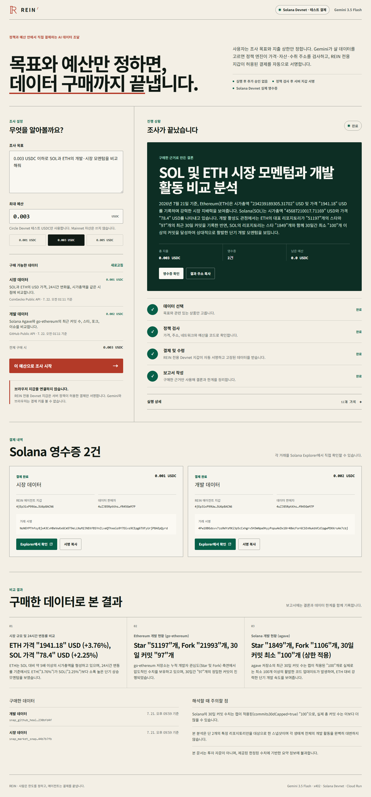
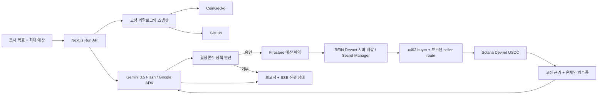

# REIN

> **목표와 예산만 정하면, AI가 필요한 데이터를 고르고 결제까지 끝냅니다.**

REIN은 유료 데이터를 대신 사는 자율 조달 에이전트입니다. 사용자는 조사 목표와
지출 상한을 한 번 정합니다. Gemini가 필요한 상품을 고르면 코드 정책이 가격·자산·
수취 주소를 검사하고, REIN 전용 서버 지갑이 Solana Devnet에서 자동으로
서명·결제합니다. 결과에는 무엇을 왜 샀는지, 얼마를 썼는지, 거래가 어디에
기록됐는지가 함께 남습니다.

- **라이브 앱:** <https://rein-vvwpcipqca-du.a.run.app>
- **GitHub:** <https://github.com/jeonsavvy/REIN>
- **결제 자산:** Circle Devnet USDC



## 30초 안에 이해하기

기본 요청은 다음과 같습니다.

> 0.003 USDC 이하로 SOL과 ETH의 개발·시장 모멘텀을 비교해줘.

REIN은 이 요청을 네 단계로 처리합니다.

1. **데이터 선택** — Gemini 3.5 Flash가 고정된 두 상품의 관련성과 가격을 비교합니다.
2. **정책 검사** — 모델 밖의 코드가 예산, URL, 네트워크, mint, 수취 주소를 확인합니다.
3. **결제와 수령** — x402로 0.001 + 0.002 테스트 USDC를 결제하고 미리 고정한 스냅샷을 받습니다.
4. **보고서 작성** — 구매 근거, 데이터 한계, Solana Explorer 영수증을 기록합니다.

사용자는 실행 중간에 다시 승인하지 않습니다. 대신 모델이 결제 키를 보거나
임의의 판매자·가격·자산을 선택할 수 없도록 자율성의 범위를 코드로 제한했습니다.

| 역할 | 하는 일 |
| --- | --- |
| 사용자 | 조사 목표와 최대 예산을 승인 |
| Gemini | 고정 카탈로그에서 살 데이터와 이유를 선택 |
| 정책 엔진 | URL, 가격, network, mint, 수취 주소와 한도를 검사 |
| REIN 서버 지갑 | 정책을 통과한 결제에 서명하고 테스트 USDC 전송 |
| REIN | 구매한 데이터만 사용해 보고서와 Explorer 영수증 작성 |

브라우저 지갑이나 MetaMask를 연결하지 않는 것은 누락이 아닙니다. 이 제품의 구매자는
사용자가 아니라 에이전트 서비스이며, Devnet 전용 키는 Secret Manager에서만
불러옵니다. Gemini와 브라우저에는 키가 전달되지 않습니다.

## 해커톤 주제와 맞닿는 지점

[공식 행사 안내](https://www.gcp-solana-ai-agentic-hacks-kr.xyz/)는 이번 행사를
**Solana 기반 Agentic Commerce 단일 트랙**으로 설명하고 A~D를 시작점으로
제시합니다. REIN은 데이터 구매라는 사용 사례가 Agent-Initiated Commerce와 겹치지만,
정책·예산 안에서 에이전트 지갑이 직접 서명·결제한다는 핵심은 굳이 분류하면
**B. Autonomous On-chain Settlement**에 가장 가깝습니다.

대회가 요구하는 “매 단계 사람 승인을 받지 않고 한도 안에서 결제하는 에이전트”를
목표 설정 → 상품 선택 → 정책 검사 → 서버 지갑 서명 → 온체인 정산 → 근거 작성의
한 실행으로 보여줍니다.

## 왜 만들었나

에이전트가 결제를 실행하면 “답이 그럴듯한가”만으로는 부족합니다.
잘못된 자산으로 결제하거나, 재시도 중 두 번 결제하거나, 근거를 받지 못했는데
완료로 표시할 수 있습니다. REIN은 **구매 결정 → 정책 승인 → 정산 → 근거**를
하나의 실행 기록에서 대조할 수 있게 만듭니다.

## 구매 가능한 데이터

| 상품 | 가격 | 결제 전에 고정하는 원본 |
| --- | ---: | --- |
| `market_snapshot` | 1,000 atomic = 0.001 테스트 USDC | CoinGecko Public API |
| `github_health` | 2,000 atomic = 0.002 테스트 USDC | GitHub Public API |

카탈로그 조회 시 원본을 먼저 읽고 `snapshotId`로 고정합니다. 결제 후에는 그
스냅샷을 반환하므로 원본 API가 중단돼도 결제한 데이터를 잃지 않습니다.

MVP에서 결제 대상은 공개 API 자체가 아니라, 같은 시점 기준으로 정규화하고 해시로
고정한 **데모용 데이터 스냅샷**입니다. CoinGecko와 GitHub 공개 데이터의 희소성을
주장하는 제품이 아니라, 향후 유료 리서치 API나 B2B 데이터 공급자에 적용할 구매·정산
계약을 작게 재현한 것입니다. 구매자와 x402 보호 판매 경로는 현재 한 Cloud Run
서비스에 함께 있어 상용 마켓플레이스가 아닌 통제된 MVP입니다.

## 구조



UI, 에이전트 API, x402 보호 API를 하나의 Next.js 서비스로 구성하고 Cloud Run에
배포합니다. 실행·이벤트·결제·일일 한도는 Firestore에 저장합니다.

## 결제 경계

- 허용 네트워크: `solana:EtWTRABZaYq6iMfeYKouRu166VU2xqa1`만 사용
- 허용 자산: Circle Devnet USDC
  `4zMMC9srt5Ri5X14GAgXhaHii3GnPAEERYPJgZJDncDU`만 사용
- 구매당 / 실행당 / 일일 상한: `4000` / `10000` / `250000` atomic USDC
- 모든 금액은 API 내부에서 6자리 atomic 문자열과 `BigInt`로 처리
- 결제 키는 Secret Manager와 서버의 정책 경계 안에서만 사용
- 사용자 브라우저 지갑 연결이나 결제별 수동 승인은 사용하지 않음
- 결제 결과가 불명확하면 자동 재결제하지 않고 `reconciling`으로 중지
- demo 모드는 항상 표시되며 서명·브로드캐스트를 하지 않음
- Firestore 브라우저 접근은 거부하고 Cloud Run 서비스 계정만 Admin SDK 사용

Solana Mainnet, 실자산, 로그인, 임의 URL 구매, 구독, 멀티에이전트는 MVP 범위 밖입니다.
전체 실패 상태와 불변식은 [`docs/specs/rein-mvp.md`](docs/specs/rein-mvp.md)에 있습니다.

## 로컬에서 실행하기

필요 환경은 Node.js 24+, Corepack, pnpm 11입니다.

```powershell
corepack enable
pnpm install --frozen-lockfile
Copy-Item .env.example .env.local
pnpm dev
```

`http://localhost:3000`을 엽니다. 기본 설정은 fixture 데이터와 메모리 저장소를
쓰는 demo 모드입니다. 이 모드에서는 결제에 서명하거나 트랜잭션을 전송하지
않습니다.
현재 공개 API 데이터만 사용하고 결제는 계속 모의 실행하려면
`PROOFBUY_UPSTREAM_MODE=live`를 설정합니다.

## API

| Method | Path | 응답 |
| --- | --- | --- |
| `POST` | `/api/runs` | `{goal,maxBudgetAtomic,preset?}` → `202 {runId}` |
| `GET` | `/api/runs/:id/events` | 정제되고 재연결 가능한 SSE 이벤트 |
| `GET` | `/api/runs/:id` | 실행 결과, 근거, 결제, 영수증 |
| `GET` | `/api/catalog` | 가격, 가용성, 스냅샷 시각 |
| `GET` | `/api/products/market-snapshot` | x402로 보호된 고정 스냅샷 |
| `GET` | `/api/products/github-health` | x402로 보호된 고정 스냅샷 |
| `GET` | `/api/health` | 비밀 값이 없는 실행 모드·저장소·모델 상태 |

## 검증하기

아래 순서가 완료 기준입니다.

```powershell
pnpm lint
pnpm typecheck
pnpm test
pnpm build
pnpm test:e2e
```

테스트에는 금액과 quota 경계, 잘못된 network/mint/route, prompt injection,
payment idempotency, 원본 API 장애, 불명확한 정산, x402 보호 경로, SSE 재연결과
데스크톱·모바일 핵심 흐름이 포함됩니다.

## Devnet 거래 증거

영상에 사용한 실행 `run_d15ee82b89cc4d179a7f664e513c1f59`은 총 3,000 atomic 테스트
USDC를 사용했습니다. 두 서명 모두 Solana RPC에서 `finalized`, `err: null`로
확인했습니다.

- 시장 데이터 1,000 atomic — [Explorer에서 보기](https://explorer.solana.com/tx/NoNGYPThfsy8jx43CvHBeVwXx6Cm5T9eLLNuM2JNEKfBSYnZLveQThxeio9Y7Divs9CEpg6TXFyUrjPBAEpQyrd?cluster=devnet)
- 개발 데이터 2,000 atomic — [Explorer에서 보기](https://explorer.solana.com/tx/4Pw18BGdsvv7zo9WYsMXi3p5cCxhgrv5H3mNpa9hyyPopuAkDx18r48WcFor6CSEnNukbVCdJpgwPDXKrsAk7cbj?cluster=devnet)

결제에는 Circle Devnet USDC를 사용했습니다. x402 facilitator가 수수료를
대납하므로 구매 지갑에 Mainnet 자산을 넣을 필요가 없습니다.

## 배포와 주소

Cloud Run live 배포는 Firestore 기록, Vertex 호출, 공개 리비전, 테스트 USDC
전송을 만듭니다. 먼저 [`docs/runbooks/live-deployment.md`](docs/runbooks/live-deployment.md)의
위험·rollback 절차를 읽고 preview를 확인합니다.

```powershell
# 변경 없는 preview
.\scripts\deploy-cloud-run.ps1 `
  -ProjectId YOUR_PROJECT_ID `
  -PayTo YOUR_DEVNET_RECEIVER

# 승인 후 배포
.\scripts\deploy-cloud-run.ps1 `
  -ProjectId YOUR_PROJECT_ID `
  -PayTo YOUR_DEVNET_RECEIVER `
  -Execute
```

Cloud Run의 기본 호스트명은 플랫폼이 자동 발급합니다. 도메인을 보유하면
`app.example.com` 같은 짧은 주소를 연결할 수 있습니다. 현재 리전의 권장 경로와
필요한 DNS 작업은
[`docs/runbooks/custom-domain.md`](docs/runbooks/custom-domain.md)에 정리했습니다.

## 프로젝트 자료

- 발표 자료 원본과 PDF: `output/presentation/`, `output/pdf/`
- 3분 이내 데모 영상과 재현 정보: `output/video/`
- 한국어 데모 대본: `docs/submission/demo-script-ko.md`
- 검증 증거: `docs/evidence/verification.md`

## 공식 문서

- [Google Cloud × Solana AI Agentic Hackathon](https://www.gcp-solana-ai-agentic-hacks-kr.xyz/)
- [Gemini 3.5 Flash](https://docs.cloud.google.com/gemini-enterprise-agent-platform/models/gemini/3-5-flash)
- [x402 buyer](https://docs.x402.org/getting-started/quickstart-for-buyers), [seller](https://docs.x402.org/getting-started/quickstart-for-sellers), [payment identifier](https://docs.x402.org/extensions/payment-identifier)
- [Solana Faucet](https://faucet.solana.com/), [Circle Faucet](https://faucet.circle.com/?allow=true)
